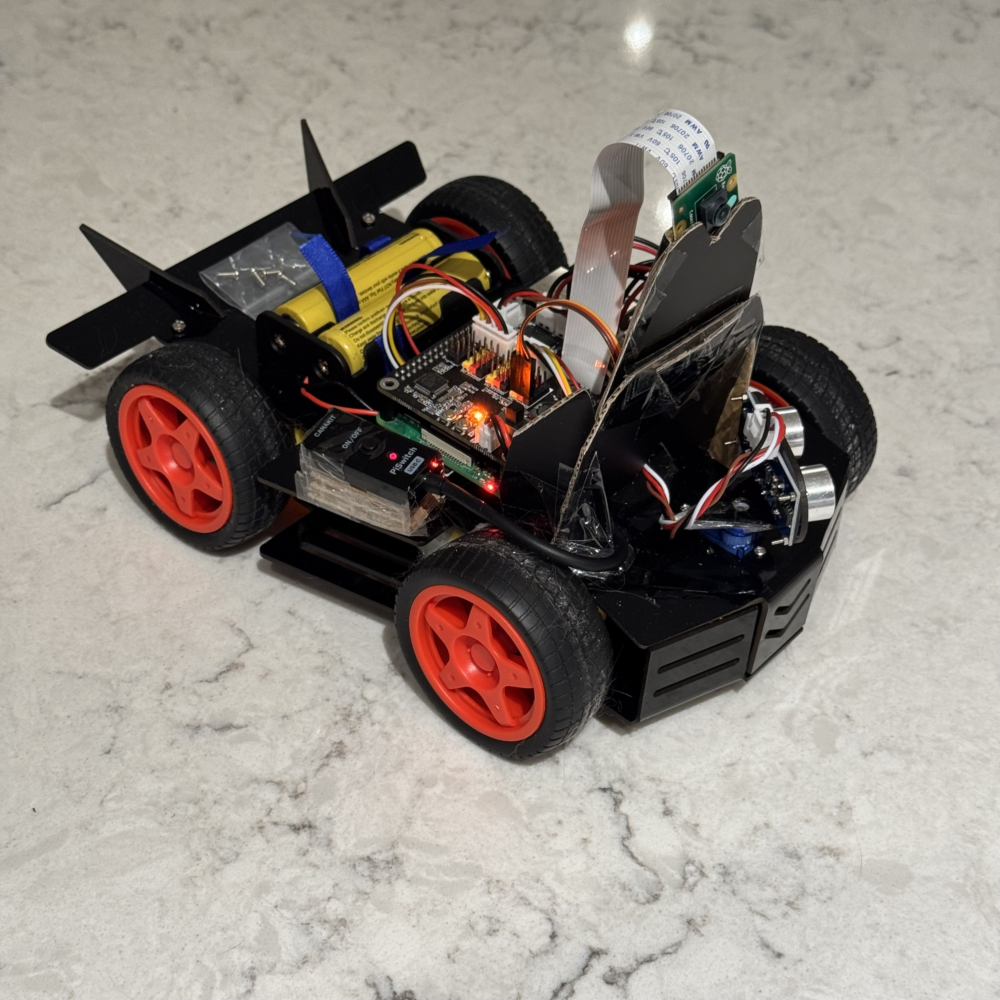
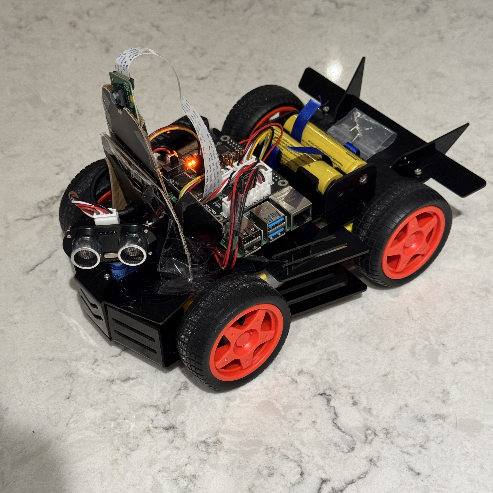

<h3 align="center">Self-Driving PiCar Algorithm</h3>

   <div align="center">
        Observe, map, navigate, MOVE!</br>
        This repository contains a self-driving car algorithm that can be used with the <a href="https://www.sunfounder.com/products/raspberry-pi-car-robot-kit-4wd" target="_blank">SunFounder Picar-4wd</a> car kit.
    </div>
</div>


## 🤖 Introduction
IoT is a fascinating world with many readily available kits to purchase. In this repository we will be utilizing the [SunFounder Picar-4wd](https://www.sunfounder.com/products/raspberry-pi-car-robot-kit-4wd) car kit to observe the surrounding and move around. 

Additionally, we will utilise a Raspberry Pi and a Raspberry Pi Camera to incorporate visual recognition of stop signs in the algorithm.


## ⚙️ Get Started

1. Setup your Raspberry Pi 4B and assemble the Picar along with the PiCamera module
2. Clone the repo for controlling the Picar onto the Raspberry Pi and follow the [instructions](https://docs.sunfounder.com/projects/picar-4wd/en/latest/test_the_modules.html) to make sure the Picar works
```bash
git clone https://github.com/sunfounder/picar-4wd
```
3. Clone the repo for object detection and install the packages
```bash
git clone https://github.com/sunfounder/vilib
cd ~/vilib
sudo python3 install.py 
```
4. Run the self_driving_picar.py file to start the algorithm.</br>A web server should begin running from which you can see the PiCamera view and the terminal should show a map of the surroundings (empty for now). After pressing enter, the car will begin navigating.


## 🚀 More
### [VIDEO DEMO](https://drive.google.com/file/d/1dDy9Mp4K4usTvoOsjg144Z3-xUqk3BSJ/)

### Images of the assembled PiCar


